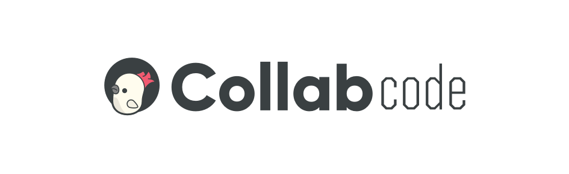

# Qattus

RESTful API for CollabCode's online course platform

## Getting Started

TBC

### Prerequisites

* JDK 11 or higher
* Maven

### Installing

TBC

## Running the tests

TBC

## Built With

* [Maven](https://maven.apache.org/) - Dependency Management
* [ROME](https://rometools.github.io/rome/) - Used to generate RSS Feeds

## Contributing

Please read [CONTRIBUTING.md](CONTRIBUTING.md) for details on our code of conduct, and the process for submitting pull requests to us.

## Authors

* **Joviane Jardim** - [@joviane](https://twitter.com/jovianejardim)
* **Marco Bruno** - [@marcobrunobr](https://twitter.com/marcobrunobr)

See also the list of [contributors](https://github.com/CollabCodeTech/qattus-api/contributors) who participated in this project.

## License

This project is licensed under the MIT License - see the [LICENSE](LICENSE.md) file for details

## Acknowledgments

Thanks to all members of CollabCode's community for the support! We love you!